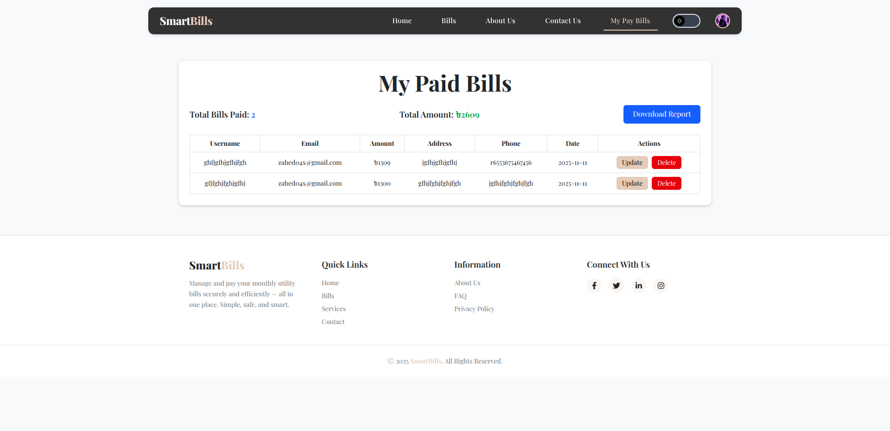

# SmartBills - Utility Bill Management System

[
[

## Overview

**SmartBills** is a modern, user-friendly utility bill management system that allows users to view, pay, and manage their electricity, gas, water, and internet bills all in one place. Built with React and powered by a robust backend, SmartBills provides a seamless experience for bill payment and tracking.

## Features

### Authentication

- **Email/Password Registration & Login**
- **Google OAuth Integration**
- **Firebase Authentication**
- **Protected Routes**
- **User Profile Management**

### Bill Management

- **View All Bills** - Browse electricity, gas, water, and internet bills
- **Category Filtering** - Filter bills by utility type
- **Bill Details** - View comprehensive bill information
- **Secure Payment** - Pay bills with instant confirmation
- **Payment History** - Track all paid bills
- **PDF Report Generation** - Download payment reports

### User Interface

- **Responsive Design** - Mobile, tablet, and desktop optimized
- **Dark/Light Theme** - Toggle between themes
- **Smooth Animations** - Framer Motion animations
- **Interactive Sliders** - Swiper integration
- **Modern UI Components** - DaisyUI components
- **Toast Notifications** - Real-time feedback

### Additional Features

- **Recent Bills Section** - Display latest bills
- **Testimonials** - User reviews and feedback
- **How It Works** - Step-by-step guide
- **Why Choose Us** - Feature highlights
- **About Us** - Company information
- **Contact Us** - Contact form and FAQ

## Technologies Used

### Frontend

- **React 19.2.0** - UI library
- **Vite 7.2.2** - Build tool and dev server
- **React Router DOM 7.9.5** - Client-side routing
- **TailwindCSS 4.1.17** - Utility-first CSS framework
- **DaisyUI 5.4.7** - Tailwind CSS component library

### Animations & UI

- **Framer Motion 12.23.24** - Animation library
- **Swiper 12.0.3** - Touch slider
- **React Icons 5.5.0** - Icon library

### Backend Integration

- **Axios 1.13.2** - HTTP client
- **Firebase 12.5.0** - Authentication & hosting
- \*\*Express Js - Create A server
- \*\*MongoDB - For Database

### Utilities

- **jsPDF 3.0.3** - PDF generation
- **jsPDF AutoTable 5.0.2** - PDF table generation
- **React Hot Toast 2.6.0** - Toast notifications
- **SweetAlert2 11.26.3** - Beautiful alerts

## Installation

### Prerequisites

- Node.js (v18 or higher)
- npm or yarn
- Firebase account
- Git

### Install Dependencies

```bash
npm install
```

### Environment Setup

Create a `.env` file in the root directory:

```env
VITE_APIKEY=your_firebase_api_key
VITE_AUTHDOMAIN=your_firebase_auth_domain
VITE_PROJECTID=your_firebase_project_id
VITE_STORAGEBUCKET=your_firebase_storage_bucket
VITE_MESSAGINGSENDERID=your_firebase_messaging_sender_id
VITE_APPID=your_firebase_app_id
```

## 🌐 Deployment

### Firebase Hosting

```bash
firebase login
firebase init
firebase deploy
```

### Netlify

```bash
netlify login
netlify init
netlify deploy --prod
```

### Vercel

```bash
vercel login
vercel --prod
```

## Theme Support

SmartBills supports light and dark themes with custom color schemes:

- **Light Theme**: Clean, modern design
- **Dark Theme**: Eye-friendly dark mode
- **Toggle Switch**: Easy theme switching in navbar

## Key Pages

### Home (`/`)

- Hero section with slider
- Featured categories
- Recent bills
- Testimonials
- How it works
- Why choose us


### About Us

- Company information and mission
- Team values
- Why choose us section


### Contact Us

- Contact form
- FAQ section
- Support information


### Bills (`/bills`)

- All available bills
- Category filtering
- Search functionality
- Bill cards with details


### Bill Details (`/bills/:id`)

- Comprehensive bill information
- Payment modal
- Secure payment processing

### My Bills (`/mybills`)

- Personal payment history
- Update/Delete bills
- Download PDF reports
- Total amount tracking



### Profile (`/profile`)

- User information
- Profile picture
- Account settings

## Authentication Flow

1. User registers with email/password or Google
2. Firebase handles authentication
3. User data stored in context
4. Protected routes check authentication
5. Redirect to login if not authenticated

## API Integration

Backend API: `https://smart-bills-server.vercel.app`

### Endpoints

- `GET /bills` - Fetch all bills
- `GET /bills/recent` - Get recent bills
- `GET /bills/:id` - Get bill details
- `GET /mybills?email=` - Get user's paid bills
- `POST /mybills` - Create payment record
- `PUT /mybills/:id` - Update payment record
- `DELETE /mybills/:id` - Delete payment record

## Contributing

Contributions are welcome! Please follow these steps:

1. Fork the repository
2. Create a feature branch (`git checkout -b feature/amazing-feature`)
3. Commit your changes (`git commit -m 'Add amazing feature'`)
4. Push to the branch (`git push origin feature/amazing-feature`)
5. Open a Pull Request

## Author

**Abu Zahed**

- GitHub: [@0xzahed](https://github.com/0xzahed)
- Repository: [SmartBills-client](https://github.com/0xzahed/SmartBills-client)

## Acknowledgments

- Icons from [React Icons](https://react-icons.github.io/react-icons/)
- UI components from [DaisyUI](https://daisyui.com/)
- Animations from [Framer Motion](https://www.framer.com/motion/)
- Backend hosting on [Vercel](https://vercel.com)
- Frontend hosting on [Firebase](https://firebase.google.com), [Netlify](https://netlify.com), and [Vercel](https://vercel.com)
